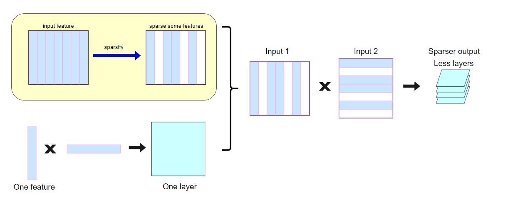

# Bert Finetune Backward Sparsify
*This is our source code of Bert finetune with backward sparsify in column form way.*
## Introduction
Our code is for sparsifying the gradient of backpropagation. To achieve this goal and get a better performance than the former works, we find a new method of sparsify based in column selection and evaluation of feature of input.



## Framework
This repo uses self defined dataloader, trainer, and evaluation framework.
We rewrite the transformers bert model into our type.

## Requirement
Go to the main folder, find the requirements.txt and run the following:
```
pip install -r requirements.txt
```
If it doesn't work, give me an issue.

## Config
```
model_type: str= 'pretrained' # pretrained' or 'finetuned'，从外部预训练模型还是本地微调后的模型导入
hidden_act: str = 'relu' # 'relu' 'relu_inplace'，就地relu还是原relu或者gelu
model_name: str="bert-base-cased" # model名称，请谨慎修改
mode = 'norm' # ['nosp', 'rand', 'norm', 'bkrz']，采用的稀疏方式，其中bkrz代表外部参考方案backrazor，nosp代表no sparse的baseline，rand代表随机稀疏方法，norm为我们的范数计算方案。
keep_frac: float=0.5 # 希望保留的数据占比
is_sparse_softmax = False # 是否对softmax线性层做稀疏
is_sparse_layer_norm = False # 是否对layernorm线性层做稀疏
dataset_path: str = "/disk3/Haonan/yanbo_random/bert_finetune_sparsify/src/self_def_datasets" # 数据集位置 
expr_name: str = 'bert_yelp_relu_20000_all_sparsity_0_norm_no_st_no_ln_inf' # 实验名称，用于区别不同runs结果。请注意不要使用已有的实验名
ckpt_path: str="/disk3/Haonan/yanbo_random/bert_finetune_sparsify/checkpoint" # 模型微调后的保存位置
load_ckpt_path = "/disk3/Haonan/yanbo_random/bert_finetune_sparsify/checkpoint" # 如果从本地导入模型，导入的路径 
log_path = "/disk3/Haonan/yanbo_random/bert_finetune_sparsify/logs" # 实验过程中保留的性能记录位置。这些是重要的实验评估数据
```

## Training
Before you run your code, edit your training_config to make sure it runs as you think.
A good example:
```
## load your dataset into your dataset folder
python src/self_def_dataset/load_dataset.py
## finetune
# find your available gpu index
nvidia-smi
CUDA_VISIBLE_DEVICES=<YOUR GPU INDEX, SPLIT BY ','> python  <YOUR REPO PATH>/src/train.py
```
If you need to edit your config, please check the file : <YOUR REPO PATH>/src/config/training_config.py 


##  Testing
Testing is quite simple, just go to the main folder, and run the following script:
```
cd src
## if you need to specialise your gpu, use this method: CUDA_VISIBLE_DEVICES=<YOUR GPU INDEX>
python test.py
## test.py is outdated, repairing
```


